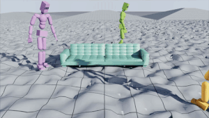
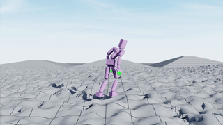
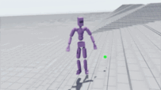
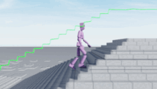

# ProtoMotions: Physics-based Character Animation
*“Primitive or fundamental types of movement that serve as a basis for more complex motions.”*

- [What is this?](#what-is-this)
- [Installation guide](#installation)
- [Training built-in agents](#training-your-agent)
- [Evaluating your agent](#evaluationvisualization)
- [Building your own agent/environment](#code-structure-how-can-i-build-my-own-stuff)

# What is this?

This codebase contains our efforts in building interactive physically-simulated virtual agents.
It supports both IsaacGym and IsaacSim.

<div float="center">
    
    
    
    
</div>

# Changelog

<details>
<summary>v1.0</summary>

Public release!

</details>

> **Important:**</br>
> This codebase builds heavily on [Hydra](https://hydra.cc/) and [OmegaConfig](https://omegaconf.readthedocs.io/).<br>
> It is recommended to familiarize yourself with these libraries and how config composition works.

# Installation

This codebase supports both IsaacGym and IsaacSim. You can install one or both and
the simulation backend is selected via the configuration file.

First run `git lfs fetch --all` to fetch all files stored in git-lfs.

<details>
<summary>IsaacGym</summary>

1. Install [IsaacGym](https://developer.nvidia.com/isaac-gym), install using **python 3.8**.
2. Once IG and PyTorch are installed, from the repository root install the Phys-Anim package and its dependencies with:
```
pip install -e .
pip install -e isaac_utils
pip install -e poselib
```
Set the `PYTHON_PATH` env variable (not really needed, but helps the instructions stay consistent between sim and gym).
```
alias PYTHON_PATH=python
```

### Potential Issues

If you have python errors:

```
export LD_LIBRARY_PATH=${CONDA_PREFIX}/lib/
```

If you run into memory issues -- try reducing the number of environments by adding to the commandline `num_envs=1024`

</details>

<details>
<summary>IsaacSim</summary>

> **Important:**</br>
> IsaacSim integration on-going. Some features may not work yet.

1. Install [IsaacSim](https://docs.omniverse.nvidia.com/isaacsim/latest/installation/install_workstation.html)
2. Set `PYTHON_PATH`
```
For Linux: alias PYTHON_PATH=~/.local/share/ov/pkg/isaac-sim-*/python.sh
For Windows: doskey PYTHON_PATH=C:\Users\user\AppData\Local\ov\pkg\isaac_sim-*\python.bat $*
For IsaacSim Docker: alias PYTHON_PATH=/isaac-sim/python.sh
```
3. Once IsaacSim is installed - from the repository root install the Physical Animation package and its dependencies with:
```
PYTHON_PATH -m pip install -e .
PYTHON_PATH -m pip install -e isaac_utils
PYTHON_PATH -m pip install -e poselib
```

</details>

# Training Your Agent

## Backbone and Robot selection

If you are using IsaacGym use the flag `+backbone=isaacgym`. For IsaacSim use `+backbone=isaacsim`.
Then select the robot you are training. For example, the SMPL humanoid robot is `+robot=smpl`. The code currently supports:

| Robot            | Description                                                        |
|------------------|--------------------------------------------------------------------|
| smpl             | SMPL humanoid                                                      |
| smplx            | SMPL-X humanoid                                                    |
| amp              | Adversarial Motion Priors humanoid                                 |
| sword_and_shield | ASE sword and shield character                                     |
| h1               | Unitree H1 humanoid with end-effector and head joints made visible |

## Provided Algorithms

<details>
<summary>MaskedMimic</summary>

In the first stage, you need to train a general motion tracker. At each step, this model receives the next K future poses.
The second phase trains the masked mimic model to reconstruct the actions of the expert tracker trained in the first stage.

1. **Train full body tracker:** Run `PYTHON_PATH phys_anim/train_agent.py +exp=full_body_tracker +robot=smpl +backbone=isaacgym motion_file=<motion file path>`
2. Find the checkpoint of the first phase. The next training should point to that folder and not the checkpoint.
3. **Train MaskedMimic:** Run `PYTHON_PATH phys_anim/train_agent.py +exp=masked_mimic +robot=smpl +backbone=isaacgym motion_file=<motion file path> gt_actor_path=<path to phase 1 folder>`
4. **Inference:** For an example of user-control, run `PYTHON_PATH phys_anim/eval_agent.py +robot=smpl +backbone=isaacgym +opt=[masked_mimic/tasks/user_control] motion_file=<motion file path> checkpoint=<path to maskedmimic checkpoint>`

add `force_flat_terrain=True` to use a default flat terrain (this reduces loading time).

</details>

<details>
<summary>Full body motion tracking</summary>

This model is the first stage in training MaskedMimic. Refer to the MaskedMimic section for instructions on training this model.
</details>

<details>
<summary>AMP</summary>

Adversarial Motion Priors (AMP, [arXiv](https://arxiv.org/abs/2104.02180)) trains
an agent to produce motions with similar distributional characteristics to a given
motion dataset. AMP can be combined with a task, encouraging the agent to solve the
task with the provided motions.

1. Run `PYTHON_PATH phys_anim/train_agent.py +exp=amp motion_file=<path to motion file>`.
2. Choose your robot, for example `+robot=amp`.
3. Set `+backbone=isaacgym` or `+backbone=isaacsim` to choose the backbone.

### Path Following

One such task for AMP is path following. The character needs to follow a set of markers.
To provide AMP with a path following task, similar to 
[PACER](https://research.nvidia.com/labs/toronto-ai/trace-pace/), run the experiment `+exp=path_follower`.

</details>

<details>
<summary>ASE</summary>

Adversarial Skill Embeddings (ASE, [arXiv](https://arxiv.org/abs/2205.01906)) trains
a low-level skill generating policy. The low-level policy is conditioned on a latent
variable z. Each latent variable represents a different motion. ASE requires a diverse
dataset of motions, as opposed to AMP that can (and often should) be trained on a single (or small set of motions) motion.

Run `PYTHON_PATH phys_anim/train_agent.py +exp=ase motion_file=<path to motion dataset>`

In order to train the sword-and-shield character, as in the original paper:
1. Git clone [ASE](https://github.com/nv-tlabs/ASE)
2. Download the data from [ASE](https://github.com/nv-tlabs/ASE)
3. Point the `motion_file` path to the dataset descriptor file `dataset_reallusion_sword_shield.yaml` (from the ASE codebase)
4. Use the robot `+robot=sword_and_shield`
</details>

## Terrain

ProtoMotions handles the terrain generation in all experiments. By default we create a flat terrain that is large enough for all humanoids to spawn with comfortable spacing between them. This is similar to the classic `env_spacing` in IsaacGym.
By add the flag `+terrain=complex`, the simulation will add an irregular terrain and normalize observations with respect to the terrain beneath the character. By default this terrain is a combination of stairs, slopes, gravel and also a flat region.
To make the controller aware of the terrain we add the terrain observations using the flag `+terrain=terrain_obs`.
It is recommended to use an experiment file and add these flags in there. See `phys_anim/config/exp/masked_mimic.yaml` for an example.

During inference you can force a flat, and simple, terrain (similar to the default IsaacGym ground plane), by `force_flat_terrain=True` or by overriding the terrain type using `+terrain=flat`. This is useful for inference, if you want to evaluate a controller (where the saved config defines a complex terrain) on a flat and simple terrain.

## Scenes

Similar to the motion library, we introduce SceneLib. This scene-management library handles spawning scenes across the simulated world.
Scenes can be very simple, but can also be arbitrarily complex. The simplest scenes are a single non-movable object, for example from the SAMP dataset.
Complex scenes can have one-or-more objects and these objects can be both non-movable and also moveable.
Each object has a set of properties, such as the position within the scene, and also a motion file that defines the motion of the object when performing motion-tracking tasks.

For more information, refer to the example `YAML` files in the `data/yaml_files` folder.

## Logging

By default, all experiments are logged using tensorboard. You can also log using Weights and Biases by adding the flag `+opt=wdb`.

# Evaluation/Visualization

To evaluate the trained agent

1. Find the checkpoint. `results/<experiment name>/lightning_logs/version_<number>`
2. Evaluate using `PYTHON_PATH phys_anim/eval_agent.py +robot=<robot> +backbone=<backend> motion_file=<path to motion file> checkpoint=results/<experiment name>/lightning_logs/version_<number>/last.ckpt`.
3. By setting `headless=False` it will also render (live visualization) the evaluation.

We provide a set of pre-defined keyboard controls.

| Key | Description                                                                |
|-----|----------------------------------------------------------------------------|
| `J` | Apply physical force to all robots (tests robustness)                      |
| `L` | Toggle recording video from viewer. Second click will save frames to video |
| `;` | Cancel recording                                                           |
| `U` | Update inference parameters (e.g., in MaskedMimic user control task)       |


# Code structure, how can I build my own stuff?

The code is split into the standard env-agent RL dichotomy.

## Agents

The agent code (located in `phys_anim/agents`) controls the logic of the agent.
For example, ASE, implemented within the `InfoMax` class, inherits the following tree: `PPO -> AMP -> InfoMax`.

## Environments

The agent training code is agnostic to the backbone simulative environment. This is not true for the
environment.

The environment code is located in `phys_anim/envs`. The first folder defines the environment type, for example `amp`.
Within each environment folder we have `common.py` which contains all the core logic for the environment, and `isaacgym.py`, `isaacsim.py`, etc... which contain the simulator specific code (e.g., IsaacGym API calls).

## Configurations

This repo is aimed to be versatile and fast to work with. Everything should be configurable, and elements should be composable by combining configs.
For example, the `opt` folder contains a collection of config options. Some of them are:
- `wdb`: Log using Weights and Biases.
- `disable_discriminator`: Disabling AMP discriminator for classes inheriting from AMP.
- `legged-robot`: Configurations for legged robots (e.g., Unitree H1).
- `record_motion`: Record motions (states) to a file.
- `record_video`: Record videos to a file.

# Data

Training the agents requires using mocap data. The `motion_file` parameter receives either an `.npy` file, for a single motion, or a `.yaml` for an entire dataset of motions.
Keep in mind that scene-based information is only extracted from the `.yaml` files, making them a requirement for such tasks.

We provide 4 example motions to get you started:
- AMP humanoid: `phys_anim/data/motions/amp_humanoid_walk.npy`
- AMP + sword and shield humanoid: `phys_anim/data/motions/amp_sword_and_shield_humanoid_walk.npy`
- SMPL humanoid: `phys_anim/data/motions/smpl_humanoid_walk.npy`
- SMPL-X humanoid: `phys_anim/data/motions/smplx_humanoid_walk.npy`
- H1 (with head and hands): `phys_anim/data/motions/h1_punch.npy`

The data processing pipeline follows the following procedure:
1. Download the data.
2. Convert AMASS to Isaac (PoseLib) format.
3. Create a YAML file with the data information (filename, FPS, textual labels, etc...).
4. Package (pre-process) the data for faster loading.

Motions can be visualized via kinematic replay by running `PYTHON_PATH phys_anim/scripts/play_motion.py <motion file> <backbone isaacgym/isaacsim> <robot type>`.


## Download Data
1. Download the [SMPL](https://smpl.is.tue.mpg.de/) v1.1.0 parameters and place them in the `data/smpl/` folder. Rename the files basicmodel_neutral_lbs_10_207_0_v1.1.0, basicmodel_m_lbs_10_207_0_v1.1.0.pkl, basicmodel_f_lbs_10_207_0_v1.1.0.pkl to SMPL_NEUTRAL.pkl, SMPL_MALE.pkl and SMPL_FEMALE.pkl. 
2. Download the [SMPL-X](https://smpl-x.is.tue.mpg.de/) v1.1 parameters and place them in the `data/smpl/` folder. Rename the files to SMPLX_NEUTRAL.pkl, SMPLX_MALE.pkl and SMPLX_FEMALE.pkl. 
3. Download the [AMASS](https://amass.is.tue.mpg.de/) dataset.
4. Download the [SAMP](https://samp.is.tue.mpg.de/) dataset.

## Convert the motions to MotionLib format
1. Run `python data/scripts/convert_amass_to_isaac.py <path_to_AMASS_data>` set `--humanoid-type=smplx` if using SMPL-X.
2. Run `python data/scripts/convert_samp_to_isaac.py <path_to_SAMP_data>` set `--humanoid-type=smplx` if using SMPL-X.
3. Copy the converted `SAMP` data to the AMASS data directory. `SAMP-filtered.yaml` requires it in the `samp-smpl/` sub-folder and `SAMP-X-filtered.yaml` in the `samp-smplx/` sub-folder.

## YAML files

You can create your own YAML files for full-control over the process.
<details>
<summary>Create your own YAML files</summary>
Example pre-generated YAML files are provided in `data/yaml_files`. To create your own YAML file, follow these steps:

1. Download the textual labels, `index.csv`, `train_val.txt, and `test.txt` from the [HML3D](https://github.com/EricGuo5513/HumanML3D) dataset.
2. Run `python data/scripts/create_motion_fps_yaml.py` and provide it with the path to the extracted AMASS (or AMASS-X) data. This will create a `.yaml` file with the true FPS for each motion. If using AMASS-X, provide it with the flags `--humanoid-type=smlx` and `--amass-fps-file` that points to the FPS file for the original AMASS dataset (e.g. `data/yaml_files/motion_fps_smpl.yaml`).
3. Run `python data/scripts/process_hml3d_data.py <yaml_file_path> --relative-path=<path_to_AMASS_data>` set `--occlusion-data-path=data/amass/amassx_occlusion_v1.pkl`,  `--humanoid-type=smplx` and `--motion-fps-path=data/yaml_files/motion_fps_smplx.yaml` if using SMPL-X.
4. To also include flipped motions, run `python data/scripts/create_flipped_file.py <path_to_yaml_file_from_last_step>`. Keep in mind that SMPL-X seems to have certain issues with flipped motions. They are not perfectly mirrored.
5. To include the SAMP data, run `python data/scripts/merge_amass_with_samp.py <path_to_amass_yaml_file_from_last_step> <path_to_samp_yaml_file> <path_to_combined_output_file>`. An example SAMP file can be found in `data/yaml_files/SAMP-filtered.yaml` or `SAMP-X-filtered.yaml` for SMPL-X.

</details>

Alternatively, you can use the pre-generated YAML files in `data/yaml_files`.

## Package the data for faster loading
Run `python data/scripts/package_motion_lib.py <path_to_yaml_file> <path_to_AMASS_data_dir> <output_pt_file_path>` set `--humanoid-type=smplx` if using SMPL-X. Add the flag `--create-text-embeddings` to create text embeddings (for MaskedMimic).

# Citation

This codebase builds upon prior work from NVIDIA and external collaborators. Please adhere to the relevant licensing in the respective repositories.
If you use this code in your work, please consider citing our works:
```bibtex
@inproceedings{tessler2024masked,
  title={MaskedMimic: Unified Physics-Based Character Control Through Masked Motion},
  author={Tessler, Chen and Guo, Yunrong and Nabati, Ofir and Chechik, Gal and Peng, Xue Bin},
  booktitle={ACM Transactions On Graphics (TOG)},
  year={2024},
  publisher={ACM New York, NY, USA}
}

@inproceedings{tessler2023calm,
  title={CALM: Conditional adversarial latent models for directable virtual characters},
  author={Tessler, Chen and Kasten, Yoni and Guo, Yunrong and Mannor, Shie and Chechik, Gal and Peng, Xue Bin},
  booktitle={ACM SIGGRAPH 2023 Conference Proceedings},
  pages={1--9},
  year={2023},
}
```

Also consider citing these prior works that helped contribute to this project:
```bibtex
@inproceedings{juravsky2024superpadl,
  title={SuperPADL: Scaling Language-Directed Physics-Based Control with Progressive Supervised Distillation},
  author={Juravsky, Jordan and Guo, Yunrong and Fidler, Sanja and Peng, Xue Bin},
  booktitle={ACM SIGGRAPH 2024 Conference Papers},
  pages={1--11},
  year={2024}
}

@inproceedings{luo2024universal,
    title={Universal Humanoid Motion Representations for Physics-Based Control},
    author={Zhengyi Luo and Jinkun Cao and Josh Merel and Alexander Winkler and Jing Huang and Kris M. Kitani and Weipeng Xu},
    booktitle={The Twelfth International Conference on Learning Representations},
    year={2024},
    url={https://openreview.net/forum?id=OrOd8PxOO2}
}

@inproceedings{Luo2023PerpetualHC,
    author={Zhengyi Luo and Jinkun Cao and Alexander W. Winkler and Kris Kitani and Weipeng Xu},
    title={Perpetual Humanoid Control for Real-time Simulated Avatars},
    booktitle={International Conference on Computer Vision (ICCV)},
    year={2023}
}            

@inproceedings{rempeluo2023tracepace,
    author={Rempe, Davis and Luo, Zhengyi and Peng, Xue Bin and Yuan, Ye and Kitani, Kris and Kreis, Karsten and Fidler, Sanja and Litany, Or},
    title={Trace and Pace: Controllable Pedestrian Animation via Guided Trajectory Diffusion},
    booktitle={Conference on Computer Vision and Pattern Recognition (CVPR)},
    year={2023}
} 

@inproceedings{hassan2023synthesizing,
  title={Synthesizing physical character-scene interactions},
  author={Hassan, Mohamed and Guo, Yunrong and Wang, Tingwu and Black, Michael and Fidler, Sanja and Peng, Xue Bin},
  booktitle={ACM SIGGRAPH 2023 Conference Proceedings},
  pages={1--9},
  year={2023}
}
```

# References and Thanks
This project repository builds upon the shoulders of giants. 
* [IsaacGymEnvs](https://github.com/isaac-sim/IsaacGymEnvs) for reference IsaacGym code. For example, terrain generation code.
* [OmniIsaacGymEnvs](https://github.com/isaac-sim/OmniIsaacGymEnvs) for reference IsaacSim code.
* [DeepMimic](https://github.com/xbpeng/DeepMimic) our full body tracker (Mimic) can be seen as a direct extension of DeepMimic.
* [ASE/AMP](https://github.com/nv-tlabs/ASE) for adversarial motion generation reference code.
* [PACER](https://github.com/nv-tlabs/pacer) for path generator code.
* [PADL/SuperPADL](https://github.com/nv-tlabs/PADL2) for initial code structure with PyTorch lightning
* [PHC](https://github.com/ZhengyiLuo/PHC) for AMASS preprocessing and conversion to Isaac (PoseLib) and reference on working with SMPL robotic humanoid.
* [SMPLSim](https://github.com/ZhengyiLuo/SMPLSim) for SMPL and SMPL-X simulated humanoid.
* [OmniH2O](https://omni.human2humanoid.com/) and [PHC-H1](https://github.com/ZhengyiLuo/PHC/tree/h1_phc) for AMASS to Isaac H1 conversion script.
* [rl_games](https://github.com/Denys88/rl_games) for reference PPO code.

Also special thanks to
* Kelly Guo for the constant help with IsaacGym/Sim!
* Evgeny Tumanov for ASE IsaacSim reference code.

# Dependencies
This project uses the following packages:
* PyTorch, [LICENSE](https://github.com/pytorch/pytorch/blob/main/LICENSE)
* PyTorch Lightning, [LICENSE](https://github.com/Lightning-AI/pytorch-lightning/blob/master/LICENSE)
* IsaacGym, [LICENSE](https://developer.download.nvidia.com/isaac/NVIDIA_Isaac_Gym_Pre-Release_Evaluation_EULA_19Oct2020.pdf)
* IsaacSim, [LICENSE](https://docs.omniverse.nvidia.com/isaacsim/latest/common/NVIDIA_Omniverse_License_Agreement.html)
* SMPLSim, [LICENSE](https://github.com/ZhengyiLuo/SMPLSim/blob/0ec11c8dd3115792b8cf0bfeaef64e8c81be592a/LICENSE)
