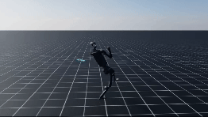
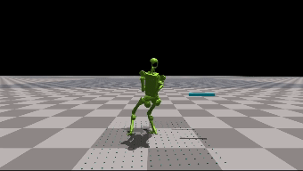
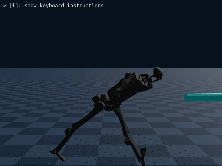

# ProtoMotions: Physics-based Character Animation
*“Primitive or fundamental types of movement that serve as a basis for more complex motions.”*

- [What is this?](#what-is-this)
- [Installation guide](#installation)
- [Training built-in agents](#training-your-agent)
- [Evaluating your agent](#evaluationvisualization)

# What is this?

This codebase contains our efforts in building interactive physically-simulated virtual agents.
It supports both IsaacGym and IsaacLab.

<div float="center">
    
    
    
    
</div>

# Known Issues

- **Genesis**:
  - Does not yet support scene creation. Waiting for simulator to support unique objects for each humanoid.
  - No support for keyboard control.
  - Does not support the capsule humanoids (e.g., SMPL), due to lack of proper MJCF parsing.
- **IsaacLab**:
  - Sword and Shield and AMP characters are not fully tested. For animation purposes, we suggest focusing on the SMPL character.

# Changelog

<details>
<summary>v2.0</summary>

- Code cleanup and refactoring.
  - Less inheritance and dependencies. This may lead to more code duplication, but much easier to parse and adapt.
  - Moved common logic into components. These components are configurable to determine their behavior.
  - All components and tasks return observation dictionaries. The network classes pick which observations to use in each component.
- Extracted simulator logic from task.
  - Common logic handles conversion to simulator-specific ordering.
  - This should make it easier to extend to new simulators.
- Added [Genesis](https://genesis-world.readthedocs.io/en/latest/index.html) support.
- New retargeting pipeline, using [Mink](https://github.com/kevinzakka/mink).

</details>
<details>
<summary>v1.0</summary>

Public release!

</details>

> **Important:**</br>
> This codebase builds heavily on [Hydra](https://hydra.cc/) and [OmegaConfig](https://omegaconf.readthedocs.io/).<br>
> It is recommended to familiarize yourself with these libraries and how config composition works.

# Installation

This codebase supports IsaacGym, IsaacLab, and Genesis. You can install the simulation of your choice, and
the simulation backend is selected via the configuration file.

First run `git lfs fetch --all` to fetch all files stored in git-lfs.

<details>
<summary>IsaacGym</summary>

1. Install [IsaacGym](https://developer.nvidia.com/isaac-gym)
```bash
wget https://developer.nvidia.com/isaac-gym-preview-4
tar -xvzf isaac-gym-preview-4
```

Install IsaacGym Python API:

```bash
pip install -e isaacgym/python
```
2. Once IG and PyTorch are installed, from the repository root install the ProtoMotions package and its dependencies with:
```bash
pip install -e .
pip install -r requirements_isaacgym.txt
pip install -e isaac_utils
pip install -e poselib
```
Set the `PYTHON_PATH` env variable (not really needed, but helps the instructions stay consistent between sim and gym).
```bash
alias PYTHON_PATH=python
```

### Potential Issues

If you have python errors:

```bash
export LD_LIBRARY_PATH=${CONDA_PREFIX}/lib/
```

If you run into memory issues -- try reducing the number of environments by adding to the commandline `num_envs=1024`

</details>

<details>
<summary>IsaacLab</summary>

1. Install [IsaacLab](https://isaac-sim.github.io/IsaacLab/main/source/setup/installation/index.html)
2. Once IsaacLAb is installed, from the repository root install the ProtoMotions package and its dependencies with:
3. Set `PYTHON_PATH` to point at the `isaaclab.sh` script
```bash
For Linux: alias PYTHON_PATH="<isaac_lab_path> -p"
# For example: alias PYTHON_PATH="/home/USERNAME/IsaacLab/isaaclab.sh -p"
```
3. Once IsaacLab is installed, from the protomotions repository root, install the Physical Animation package and its dependencies with:
```bash
PYTHON_PATH -m pip install -e .
PYTHON_PATH -m pip install -r requirements_isaaclab.txt
PYTHON_PATH -m pip install -e isaac_utils
PYTHON_PATH -m pip install -e poselib
```

</details>
<details>
<summary>Genesis</summary>

1. Install [Genesis](https://genesis-world.readthedocs.io/en/latest/index.html), install using **python 3.10**.
2. Once Genesis is installed, from the repository root install the ProtoMotions package and its dependencies with:
```bash
pip install -e .
pip install -r requirements_genesis.txt
pip install -e isaac_utils
pip install -e poselib
```
Set the `PYTHON_PATH` env variable (not really needed, but helps the instructions stay consistent between sim and gym).
```bash
alias PYTHON_PATH=python
```

</details>

# Training Your Agent

A set of example scripts are provided in the `examples` folder. These present a simple and contained reference for how to use the framework's components.

The simplest example for training an agent is:
```bash
PYTHON_PATH protomotions/train_agent.py +exp=steering_mlp +robot=h1 +simulator=<simulator> +experiment_name=h1_steering
```

<div float="center">
    
    
    
</div>

which will train a steering agent using the Unitree H1 humanoid on the selected simulator. This does not use any reference data or discriminative rewards. It optimizes using pure task-rewards using PPO.

The `experiment_name` determines where all the experiment results and parameters will be stored. Each experiment should have a unique experiment name. When training with an existing experiment name, the training code will automatically resume from the last checkpoint.

## Backbone and Robot selection

If you are using IsaacGym use the flag `+simulator=isaacgym`. For IsaacLab use `+simulator=isaaclab`. For Genesis use `+simulator=genesis`.
Then select the robot you are training. For example, the SMPL humanoid robot is `+robot=smpl`. The code currently supports:

| Robot            | Description                                                               |
|------------------|---------------------------------------------------------------------------|
| smpl             | SMPL humanoid                                                             |
| smplx            | SMPL-X humanoid                                                           |
| amp              | Adversarial Motion Priors humanoid                                        |
| sword_and_shield | ASE sword and shield character                                            |
| h1               | Unitree H1 humanoid with arm-stub (where the hand connects), toes, and head joints made visible |

## Provided Algorithms

<details>
<summary>MaskedMimic</summary>

In the first stage, you need to train a general motion tracker. At each step, this model receives the next K future poses.
The second phase trains the masked mimic model to reconstruct the actions of the expert tracker trained in the first stage.

1. **Train full body tracker:** Run `PYTHON_PATH protomotions/train_agent.py +exp=full_body_tracker/transformer_flat_terrain +robot=smpl +simulator=isaacgym motion_file=<motion file path> +experiment_name=full_body_tracker`
2. Find the checkpoint of the first phase. It will be stored in `results/<experiment_name>/last.ckpt`. The next training should point to the folder and not the checkpoint.
3. **Train MaskedMimic:** Run `PYTHON_PATH protomotions/train_agent.py +exp=masked_mimic/flat_terrain +robot=smpl +simulator=isaacgym motion_file=<motion file path> agent.config.expert_model_path=<path to phase 1 folder>`
4. **Inference:** For an example of user-control, run `PYTHON_PATH protomotions/eval_agent.py +robot=smpl +simulator=isaacgym +opt=[masked_mimic/tasks/user_control] checkpoint=<path to maskedmimic checkpoint>`

add `+terrain=flat` to use a default flat terrain (this reduces loading time).

</details>

<details>
<summary>Full body motion tracking (Advanced DeepMimic)</summary>

This model is the first stage in training MaskedMimic. Refer to the MaskedMimic section for instructions on training this model.
</details>

<details>
<summary>AMP</summary>

Adversarial Motion Priors (AMP, [arXiv](https://arxiv.org/abs/2104.02180)) trains
an agent to produce motions with similar distributional characteristics to a given
motion dataset. AMP can be combined with a task, encouraging the agent to solve the
task with the provided motions.

1. Run `PYTHON_PATH protomotions/train_agent.py +exp=amp_mlp motion_file=<path to motion file>`.
2. Choose your robot, for example `+robot=amp`.
3. Set simulator, for example `+simulator=genesis`.

### Path Following

One such task for AMP is path following. The character needs to follow a set of markers.
To provide AMP with a path following task, similar to 
[PACER](https://research.nvidia.com/labs/toronto-ai/trace-pace/), run the experiment `+exp=path_follower_amp_mlp`.

</details>

<details>
<summary>ASE</summary>

Adversarial Skill Embeddings (ASE, [arXiv](https://arxiv.org/abs/2205.01906)) trains
a low-level skill generating policy. The low-level policy is conditioned on a latent
variable z. Each latent variable represents a different motion. ASE requires a diverse
dataset of motions, as opposed to AMP that can (and often should) be trained on a single (or small set of motions) motion.

Run `PYTHON_PATH protomotions/train_agent.py +exp=ase_mlp motion_file=<path to motion dataset>`

In order to train the sword-and-shield character, as in the original paper:
1. Download the data from [ASE](https://github.com/nv-tlabs/ASE)
2. Point the `motion_file` path to the dataset descriptor file `dataset_reallusion_sword_shield.yaml` (from the ASE codebase)
3. Use the robot `+robot=sword_and_shield`
</details>

## Terrain

An example for creating irregular terrains is provided in `examples/isaacgym_complex_terrain.py`.

ProtoMotions handles the terrain generation in all experiments. By default we create a flat terrain that is large enough for all humanoids to spawn with comfortable spacing between them. This is similar to the standard `env_spacing`.
By adding the flag `+terrain=complex`, the simulation will add an irregular terrain and normalize observations with respect to the terrain beneath the character. By default this terrain is a combination of stairs, slopes, gravel and also a flat region.

A controller can be made aware of the terrain around it. See an example in the `path_follower_mlp` experiment config.

During inference you can force a flat, and simple, terrain, by `+terrain=flat`. This is useful for inference, if you want to evaluate a controller (where the saved config defines a complex terrain) on a flat and simple terrain.

## Scenes

An example for creating a scene with an elephant object placed on a floating table is provided in `examples/isaaclab_spawning_scenes.py`.

Similar to the motion library, we introduce SceneLib. This scene-management library handles spawning scenes across the simulated world.
Scenes can be very simple, but can also be arbitrarily complex. The simplest scenes are a single non-movable object, for example from the [SAMP](https://samp.is.tue.mpg.de/) dataset.
Complex scenes can have one-or-more objects and these objects can be both non-movable and also moveable.
Each object has a set of properties, such as the position within the scene, and also a motion file that defines the motion of the object when performing motion-tracking tasks.

## Logging

To properly log and track your experiments we suggest using "Weights and Biases" by adding the flag `+opt=wandb`.

# Evaluation/Visualization

To evaluate the trained agent, run `PYTHON_PATH protomotions/eval_agent.py +robot=<robot> +simulator=<simulator> motion_file=<path to motion file> checkpoint=results/<experiment name>/last.ckpt`.

We provide a set of pre-defined keyboard controls.

| Key | Description                                                                |
|-----|----------------------------------------------------------------------------|
| `J` | Apply physical force to all robots (tests robustness)                      |
| `R` | Reset the task                                                             |
| `O` | Toggle camera. Will cycle through all entities in the scene.               |
| `L` | Toggle recording video from viewer. Second click will save frames to video |
| `;` | Cancel recording                                                           |
| `U` | Update inference parameters (e.g., in MaskedMimic user control task)       |
| `Q` | Quit       |

## Configurations

This repo is aimed to be versatile and fast to work with. Everything should be configurable, and elements should be composable by combining configs.
For example, see the MaskedMimic configurations under the experiment folder.

# Data

Training the agents requires using mocap data. The `motion_file` parameter receives either an `.npy` file, for a single motion, or a `.yaml` for an entire dataset of motions.

We provide example motions to get you started:
- AMP humanoid: `data/motions/amp_humanoid_walk.npy`
- AMP + sword and shield humanoid: `data/motions/amp_sword_and_shield_humanoid_walk.npy`
- SMPL humanoid: `data/motions/smpl_humanoid_walk.npy`
- SMPL-X humanoid: `data/motions/smplx_humanoid_walk.npy`
- H1 (with head, toes, and arm-stubs): `data/motions/h1_walk.npy`

The data processing pipeline follows the following procedure:
1. Download the data.
2. Convert AMASS to Isaac (PoseLib) format.
3. Create a YAML file with the data information (filename, FPS, textual labels, etc...).
4. Package (pre-process) the data for faster loading.

Motions can be visualized via kinematic replay by running `PYTHON_PATH protomotions/scripts/play_motion.py <motion file> <simulator isaacgym/isaaclab/genesis> <robot type>`.


## Download Data
1. Download the [SMPL](https://smpl.is.tue.mpg.de/) v1.1.0 parameters and place them in the `data/smpl/` folder. Rename the files basicmodel_neutral_lbs_10_207_0_v1.1.0, basicmodel_m_lbs_10_207_0_v1.1.0.pkl, basicmodel_f_lbs_10_207_0_v1.1.0.pkl to SMPL_NEUTRAL.pkl, SMPL_MALE.pkl and SMPL_FEMALE.pkl. 
2. Download the [SMPL-X](https://smpl-x.is.tue.mpg.de/) v1.1 parameters and place them in the `data/smpl/` folder. Rename the files to SMPLX_NEUTRAL.pkl, SMPLX_MALE.pkl and SMPLX_FEMALE.pkl. 
3. Download the [AMASS](https://amass.is.tue.mpg.de/) dataset.

## Convert the motions to MotionLib format

Run `python data/scripts/convert_amass_to_isaac.py <path_to_AMASS_data>`.
- If using SMPL-X data, set `--humanoid-type=smplx`.
- To retarget to the Unitree H1, set `--robot-type=h1` and `--force-retarget`. This will use [Mink](https://github.com/kevinzakka/mink/) for retargeting the motions.

## YAML files

You can create your own YAML files for full-control over the process.
<details>
<summary>Create your own YAML files</summary>
Example pre-generated YAML files are provided in `data/yaml_files`. To create your own YAML file, follow these steps:

1. Download the textual labels, `index.csv`, `train_val.txt, and `test.txt` from the [HML3D](https://github.com/EricGuo5513/HumanML3D) dataset.
2. Run `python data/scripts/create_motion_fps_yaml.py` and provide it with the path to the extracted AMASS (or AMASS-X) data. This will create a `.yaml` file with the true FPS for each motion. If using AMASS-X, provide it with the flags `--humanoid-type=smlx` and `--amass-fps-file` that points to the FPS file for the original AMASS dataset (e.g. `data/yaml_files/motion_fps_smpl.yaml`).
3. Run `python data/scripts/process_hml3d_data.py <yaml_file_path> --relative-path=<path_to_AMASS_data>` set `--occlusion-data-path=data/amass/amassx_occlusion_v1.pkl`,  `--humanoid-type=smplx` and `--motion-fps-path=data/yaml_files/motion_fps_smplx.yaml` if using SMPL-X.
4. To also include flipped motions, run `python data/scripts/create_flipped_file.py <path_to_yaml_file_from_last_step>`. Keep in mind that SMPL-X seems to have certain issues with flipped motions. They are not perfectly mirrored.

</details>

Alternatively, you can use the pre-generated YAML files in `data/yaml_files`.

## Package the data for faster loading
Run `python data/scripts/package_motion_lib.py <path_to_yaml_file> <path_to_AMASS_data_dir> <output_pt_file_path>` set `--humanoid-type=smplx` if using SMPL-X. Add the flag `--create-text-embeddings` to create text embeddings (for MaskedMimic).

# Citation

This codebase builds upon prior work from NVIDIA and external collaborators. Please adhere to the relevant licensing in the respective repositories.
If you use this code in your work, please consider citing our works:
```bibtex
@misc{ProtoMotions,
  title = {ProtoMotions: Physics-based Character Animation},
  author = {Tessler, Chen and Juravsky, Jordan and Guo, Yunrong and Jiang, Yifeng and Coumans, Erwin and Peng, Xue Bin},
  year = {2024},
  publisher = {GitHub},
  journal = {GitHub repository},
  howpublished = {\url{https://github.com/NVLabs/ProtoMotions/}},
}

@inproceedings{tessler2024masked,
  title={MaskedMimic: Unified Physics-Based Character Control Through Masked Motion},
  author={Tessler, Chen and Guo, Yunrong and Nabati, Ofir and Chechik, Gal and Peng, Xue Bin},
  booktitle={ACM Transactions On Graphics (TOG)},
  year={2024},
  publisher={ACM New York, NY, USA}
}

@inproceedings{tessler2023calm,
  title={CALM: Conditional adversarial latent models for directable virtual characters},
  author={Tessler, Chen and Kasten, Yoni and Guo, Yunrong and Mannor, Shie and Chechik, Gal and Peng, Xue Bin},
  booktitle={ACM SIGGRAPH 2023 Conference Proceedings},
  pages={1--9},
  year={2023},
}
```

Also consider citing these prior works that helped contribute to this project:
```bibtex
@inproceedings{juravsky2024superpadl,
  title={SuperPADL: Scaling Language-Directed Physics-Based Control with Progressive Supervised Distillation},
  author={Juravsky, Jordan and Guo, Yunrong and Fidler, Sanja and Peng, Xue Bin},
  booktitle={ACM SIGGRAPH 2024 Conference Papers},
  pages={1--11},
  year={2024}
}

@inproceedings{luo2024universal,
    title={Universal Humanoid Motion Representations for Physics-Based Control},
    author={Zhengyi Luo and Jinkun Cao and Josh Merel and Alexander Winkler and Jing Huang and Kris M. Kitani and Weipeng Xu},
    booktitle={The Twelfth International Conference on Learning Representations},
    year={2024},
    url={https://openreview.net/forum?id=OrOd8PxOO2}
}

@inproceedings{Luo2023PerpetualHC,
    author={Zhengyi Luo and Jinkun Cao and Alexander W. Winkler and Kris Kitani and Weipeng Xu},
    title={Perpetual Humanoid Control for Real-time Simulated Avatars},
    booktitle={International Conference on Computer Vision (ICCV)},
    year={2023}
}            

@inproceedings{rempeluo2023tracepace,
    author={Rempe, Davis and Luo, Zhengyi and Peng, Xue Bin and Yuan, Ye and Kitani, Kris and Kreis, Karsten and Fidler, Sanja and Litany, Or},
    title={Trace and Pace: Controllable Pedestrian Animation via Guided Trajectory Diffusion},
    booktitle={Conference on Computer Vision and Pattern Recognition (CVPR)},
    year={2023}
} 

@inproceedings{hassan2023synthesizing,
  title={Synthesizing physical character-scene interactions},
  author={Hassan, Mohamed and Guo, Yunrong and Wang, Tingwu and Black, Michael and Fidler, Sanja and Peng, Xue Bin},
  booktitle={ACM SIGGRAPH 2023 Conference Proceedings},
  pages={1--9},
  year={2023}
}
```

# References and Thanks
This project repository builds upon the shoulders of giants. 
* [IsaacGymEnvs](https://github.com/isaac-sim/IsaacGymEnvs) for reference IsaacGym code. For example, terrain generation code.
* [OmniIsaacGymEnvs](https://github.com/isaac-sim/OmniIsaacGymEnvs) for reference IsaacSim code.
* [DeepMimic](https://github.com/xbpeng/DeepMimic) our full body tracker (Mimic) can be seen as a direct extension of DeepMimic.
* [ASE/AMP](https://github.com/nv-tlabs/ASE) for adversarial motion generation reference code.
* [PACER](https://github.com/nv-tlabs/pacer) for path generator code.
* [PADL/SuperPADL](https://github.com/nv-tlabs/PADL2) and Jordan Juravsky for initial code structure with PyTorch lightning
* [PHC](https://github.com/ZhengyiLuo/PHC) for AMASS preprocessing and conversion to Isaac (PoseLib) and reference on working with SMPL robotic humanoid.
* [SMPLSim](https://github.com/ZhengyiLuo/SMPLSim) for SMPL and SMPL-X simulated humanoid.
* [OmniH2O](https://omni.human2humanoid.com/) and [PHC-H1](https://github.com/ZhengyiLuo/PHC/tree/h1_phc) for AMASS to Isaac H1 conversion script.
* [rl_games](https://github.com/Denys88/rl_games) for reference PPO code.
* [Mink](https://github.com/kevinzakka/mink/) and Kevin Zakka for help with the retargeting.

The following people have contributed to this project:
* Chen Tessler, Yifeng Jiang, Xue Bin Peng, Erwin Coumans, Kelly Guo, and Jordan Juravsky.

# Dependencies
This project uses the following packages:
* PyTorch, [LICENSE](https://github.com/pytorch/pytorch/blob/main/LICENSE)
* PyTorch Lightning, [LICENSE](https://github.com/Lightning-AI/pytorch-lightning/blob/master/LICENSE)
* IsaacGym, [LICENSE](https://developer.download.nvidia.com/isaac/NVIDIA_Isaac_Gym_Pre-Release_Evaluation_EULA_19Oct2020.pdf)
* IsaacSim, [LICENSE](https://docs.omniverse.nvidia.com/isaacsim/latest/common/NVIDIA_Omniverse_License_Agreement.html)
* IsaacLab, [LICENSE](https://isaac-sim.github.io/IsaacLab/main/source/refs/license.html)
* Genesis, [LICENSE](https://github.com/Genesis-Embodied-AI/Genesis/blob/main/LICENSE)
* SMPLSim, [LICENSE](https://github.com/ZhengyiLuo/SMPLSim/blob/0ec11c8dd3115792b8cf0bfeaef64e8c81be592a/LICENSE)
* Mink, [LICENSE](https://github.com/kevinzakka/mink/blob/main/LICENSE)
