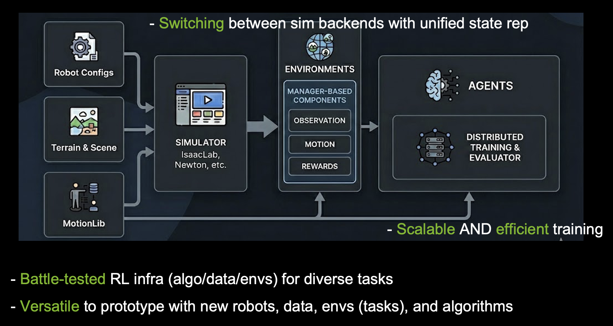

ProtoMotions Documentation
==========================

.. raw:: html

   

     <video autoplay loop muted playsinline style="width: 100%; border-radius: 8px;">
       <source src="_static/banner.mp4" type="video/mp4">
       Your browser does not support the video tag.
     </video>
   

ProtoMotions is a GPU-accelerated simulation and learning framework for training physically simulated 
digital humans and humanoid robots. Our mission is to provide a fast prototyping platform for various 
simulated humanoid learning tasks and environments, bridging efforts across physics-based animation, 
digital humans, and humanoid robotics.

.. note::

   This project will download and install additional third-party open source software projects. Review the license terms of these open source projects before use.

Key Features
------------

* **GPU-Accelerated**: Fast, scalable simulation for reinforcement learning workflows with NVIDIA Newton (beta), IsaacGym, IsaacLab, and Genesis backends
* **Modular Design**: Multiple simulation backends, robot morphologies, RL environments, and algorithms with built-in support. Add your own robot, task, or algorithm with ease
* **Rich Toolkit**: Built-in procedural terrain generation, motion retargeting (PyRoki-based), scene and object spawning. All scalable to large training runs
* **State-of-the-Art Algorithms**: MaskedMimic, AMP, ASE, PPO implementations
* **Multiple Robots**: SMPL, SMPL-X, Unitree G1, H1, and custom morphologies
* **Open Source**: Permissively licensed under Apache-2.0

High-Level Architecture
-----------------------

Quick Links
-----------

* :doc:`getting_started/installation` - Install and set up
* :doc:`getting_started/quickstart` - Run pre-trained models and start training
* :doc:`tutorials/index` - Step-by-step tutorials and workflows
* :doc:`concepts/index` - Core abstractions and design
* :doc:`api_reference/index` - Complete API reference

.. toctree::
   :maxdepth: 2
   :caption: Getting Started
   :hidden:

   getting_started/installation
   getting_started/quickstart
   getting_started/amass_preparation
   getting_started/phuma_preparation

.. toctree::
   :maxdepth: 1
   :caption: Tutorials
   :hidden:

   tutorials/index
   tutorials/code_tutorials
   tutorials/workflows/amass_smpl
   tutorials/workflows/retargeting_pyroki
   tutorials/workflows/vaulting
   tutorials/workflows/domain_randomization
   tutorials/workflows/custom_robot
   tutorials/challenges

.. toctree::
   :maxdepth: 2
   :caption: User Guide
   :hidden:

   user_guide/configuration
   user_guide/experiments
   user_guide/slurm_training
   user_guide/developer_tips

.. toctree::
   :maxdepth: 2
   :caption: Key Concepts
   :hidden:

   concepts/index
   concepts/architecture
   concepts/abstractions
   concepts/environment_context
   concepts/pose_lib
   concepts/simulator_state

.. toctree::
   :maxdepth: 2
   :caption: API Reference
   :hidden:

   api_reference/index

.. toctree::
   :maxdepth: 1
   :caption: Community
   :hidden:

   contributing
