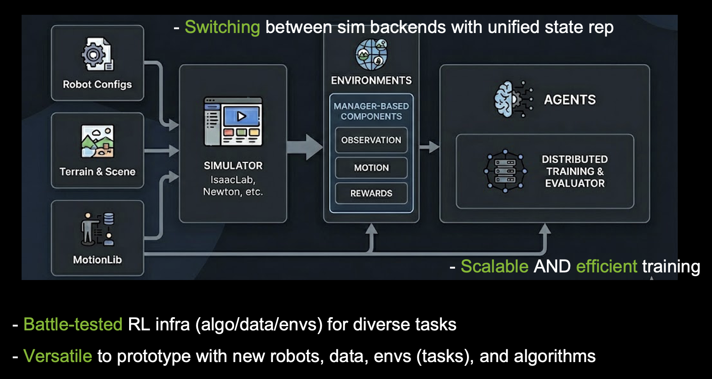

ProtoMotions Documentation
==========================

.. raw:: html

   

     <video autoplay loop muted playsinline style="width: 100%; border-radius: 8px;">
       <source src="_static/banner.mp4" type="video/mp4">
       Your browser does not support the video tag.
     </video>
   

ProtoMotions is a GPU-accelerated simulation and learning framework for training physically simulated 
digital humans and humanoid robots. Our mission is to provide a fast prototyping platform for various 
simulated humanoid learning tasks and environments, bridging efforts across physics-based animation, 
digital humans, and humanoid robotics.

.. raw:: html

   

     <svg height="32" width="32" viewBox="0 0 16 16" fill="white" style="flex-shrink: 0;">
       <path d="M8 0C3.58 0 0 3.58 0 8c0 3.54 2.29 6.53 5.47 7.59.4.07.55-.17.55-.38 0-.19-.01-.82-.01-1.49-2.01.37-2.53-.49-2.69-.94-.09-.23-.48-.94-.82-1.13-.28-.15-.68-.52-.01-.53.63-.01 1.08.58 1.23.82.72 1.21 1.87.87 2.33.66.07-.52.28-.87.51-1.07-1.78-.2-3.64-.89-3.64-3.95 0-.87.31-1.59.82-2.15-.08-.2-.36-1.02.08-2.12 0 0 .67-.21 2.2.82.64-.18 1.32-.27 2-.27.68 0 1.36.09 2 .27 1.53-1.04 2.2-.82 2.2-.82.44 1.1.16 1.92.08 2.12.51.56.82 1.27.82 2.15 0 3.07-1.87 3.75-3.65 3.95.29.25.54.73.54 1.48 0 1.07-.01 1.93-.01 2.2 0 .21.15.46.55.38A8.013 8.013 0 0016 8c0-4.42-3.58-8-8-8z"/>
     </svg>
     

       
ProtoMotions on GitHub

       
Star us, report issues, and contribute

     

     <a href="https://github.com/NVlabs/ProtoMotions" target="_blank" rel="noopener noreferrer"
        style="display: inline-block; padding: 8px 20px; background: #238636; color: white; border-radius: 6px; text-decoration: none; font-weight: 600; font-size: 0.95em;">
       View Repository &rarr;
     </a>
   

.. note::

   This project will download and install additional third-party open source software projects. Review the license terms of these open source projects before use.

Key Features
------------

* **Multi-Backend**: Fast, scalable simulation with NVIDIA Newton (beta), IsaacGym, IsaacLab, Genesis (GPU), and MuJoCo (CPU) backends
* **Modular Design**: Multiple simulation backends, robot morphologies, RL environments, and algorithms with built-in support. Add your own robot, task, or algorithm with ease
* **Rich Toolkit**: Built-in procedural terrain generation, motion retargeting (PyRoki-based), scene and object spawning. All scalable to large training runs
* **State-of-the-Art Algorithms**: MaskedMimic, AMP, ASE, PPO implementations
* **Multiple Robots**: SMPL, SMPL-X, Unitree G1, H1, and custom morphologies
* **Open Source**: Permissively licensed under Apache-2.0

Simulator Support
-----------------

.. raw:: html

   

     
     
     
     
     
   

High-Level Architecture
-----------------------

Quick Links
-----------

* :doc:`getting_started/installation` - Install and set up
* :doc:`getting_started/quickstart` - Run pre-trained models and start training
* :doc:`tutorials/index` - Step-by-step tutorials and workflows
* :doc:`concepts/index` - Core abstractions and design
* :doc:`api_reference/index` - Complete API reference

.. toctree::
   :maxdepth: 2
   :caption: Getting Started
   :hidden:

   getting_started/installation
   getting_started/quickstart
   getting_started/amass_preparation
   getting_started/phuma_preparation
   getting_started/seed_bvh_preparation
   getting_started/seed_g1_csv_preparation
   getting_started/kimodo_preparation

.. toctree::
   :maxdepth: 1
   :caption: Tutorials
   :hidden:

   tutorials/index
   tutorials/code_tutorials
   tutorials/workflows/amass_smpl
   tutorials/workflows/retargeting_pyroki
   tutorials/workflows/vaulting
   tutorials/workflows/domain_randomization
   tutorials/workflows/g1_deployment
   tutorials/workflows/custom_robot
   tutorials/challenges

.. toctree::
   :maxdepth: 2
   :caption: User Guide
   :hidden:

   user_guide/configuration
   user_guide/experiments
   user_guide/slurm_training
   user_guide/developer_tips

.. toctree::
   :maxdepth: 2
   :caption: Key Concepts
   :hidden:

   concepts/index
   concepts/architecture
   concepts/abstractions
   concepts/environment_context
   concepts/pose_lib
   concepts/simulator_state

.. toctree::
   :maxdepth: 2
   :caption: API Reference
   :hidden:

   api_reference/index

.. toctree::
   :maxdepth: 1
   :caption: Community
   :hidden:

   contributing
