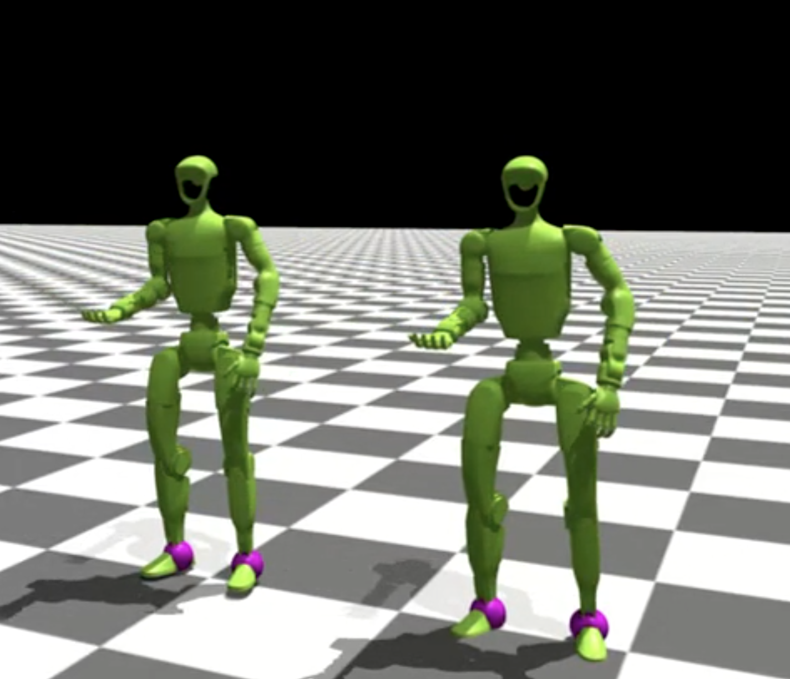

Developer Tips
==============

Quality of life tips for working with ProtoMotions.

Testing Simulator Setup
-----------------------

Use ``random_pose_visualizer.py`` to verify a robot loads correctly:

.. code-block:: bash

   python examples/random_pose_visualizer.py \
       --robot g1 \
       --simulator isaacgym

This sets random joint poses with **zero gravity and zero torque**. 
The robot should be able to hold its reset pose (press R key to reset).

This is the first thing to test when adding a new robot or a new simulator backend.

Comparing Motion Libraries
--------------------------

Use ``motion_libs_visualizer.py`` to compare ground truth vs learned motions:

.. code-block:: bash

   python examples/motion_libs_visualizer.py \
       --motion_files gt_motions.pt predicted_motions.pt \
       --robot g1 \
       --simulator isaacgym

**Features:**

* Side-by-side playback
* Yellow markers highlight jittery body parts (high normalized jerk)
* Purple markers highlight contact points with the ground
* Smoothness metrics (normalized jerk, oscillation index)
* Adjustable playback speed

**Saving predicted motions:**

Run inference in full-eval mode to save the predicted motion library:

.. code-block:: bash

   python protomotions/inference_agent.py \
       --checkpoint results/my_exp/last.ckpt \
       --simulator isaacgym \
       --full-eval \
       --headless \
       --num-envs 1024

Understanding Prioritized Sampling
----------------------------------

Motion imitation uses prioritized sampling to focus on harder motions:

**How it works:**

1. Evaluator periodically runs full evaluation on all motions
2. Computes success rate for each motion
3. Assigns higher sampling weight to failed/difficult motions
4. Training samples more from difficult cases

**Where this is done in code:**

.. code-block:: python

   def update_motion_sampling_weights(self, metrics: Dict[str, MotionMetrics]):
       """
       Update motion sampling weights based on success/failure rates.
       """
       pass

**Symptoms:**

* ``Train/episode_reward`` drops a bit 

**What's actually happening:**

Training is now focusing on harder motions. The policy hasn't gotten worse - 
it's practicing more difficult cases.

**What to monitor:**

* ``Eval/gt_err`` - Unbiased position error (evaluates all motions equally)
* ``Eval/success_rate`` - Unbiased success rate

These eval metrics don't use prioritized sampling and give true performance.

Train Agent Modes
-----------------

``train_agent.py`` has three modes:

**1. Fresh Start:**

New experiment name → build configs from experiment file

.. code-block:: bash

   python protomotions/train_agent.py \
       --experiment-name new_experiment \
       ...

**2. Resume:**

Same experiment name with existing checkpoint → load exact saved configs

.. code-block:: bash

   # First run
   python protomotions/train_agent.py --experiment-name my_exp ...
   
   # Resume (uses saved configs, ignores CLI overrides!)
   python protomotions/train_agent.py --experiment-name my_exp ...

.. warning::

   CLI overrides (``--overrides``) are **ignored** during resume. The system
   uses exactly the saved configs from the first run.

**3. Warm Start:**

``--checkpoint`` with new experiment name → old weights, new configs

.. code-block:: bash

   python protomotions/train_agent.py \
       --experiment-name new_exp_with_changes \
       --checkpoint results/old_exp/last.ckpt \
       ...

Create Config Only Mode
-----------------------

Generate configs without training:

.. code-block:: bash

   python protomotions/train_agent.py \
       --experiment-name migration_test \
       ... \
       --create-config-only

Useful for:

* Migrating old checkpoints when config APIs change
* Verifying configs before long training runs
* Debugging config composition

Kinematic Playback for Debugging
--------------------------------

Test motion + scene alignment without physics:

.. code-block:: bash

   python examples/env_kinematic_playback.py \
       --experiment-path examples/experiments/mimic/mlp.py \
       --motion-file my_motions.pt \
       --robot-name g1 \
       --simulator isaacgym \
       --scenes-file my_scenes.pt

This plays motions kinematically (sets poses directly, no simulation). Use to verify:

* Motion data is correct
* Scene objects are positioned correctly
* Retargeting didn't break anything

